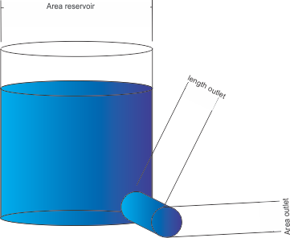
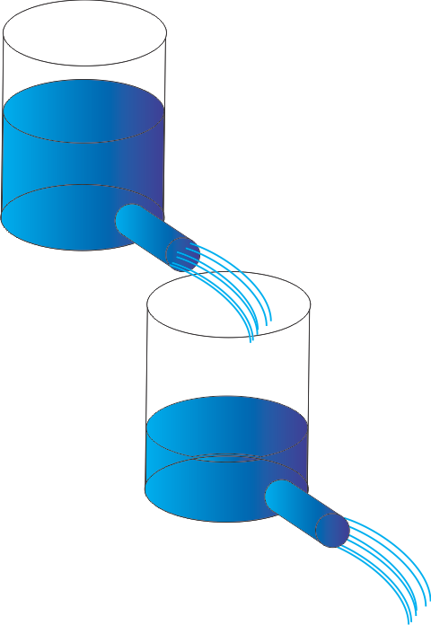
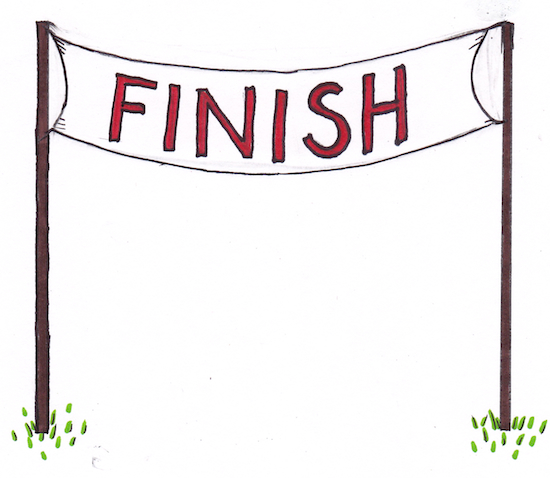

<!-- --- -->
<!-- title: "Finite Differences for Time Models" -->
<!-- author: "G.Bier" -->
<!-- date: "1 december 2017" -->
<!-- output: html_document -->
<!-- --- -->

```{r setup, include=FALSE}
knitr::opts_chunk$set(echo = TRUE)
rm(list = ls())
```

##Introduction
With this markdown you are going to to analyse the effect of properties and numerical schemes on the behavior of the solutions for simple 0D (no spatial dimensions) kind of models, known as bucket or reservoir models. The differential equations that need to be solved are simple ordinary differential equations. The solutions are based on different numerical schemes that need to be investigated and compared.
The following types of reservoir models are considered:

1. one reservoir no input;  
2. one reservoir input and output;
    + 2.1 Numerical Schemes:
        + 2.1.1 Explicit (Euler)
        + 2.1.2 Implicit
        + 2.1.3 Modified Euler (Heun)
        + 2.1.4 Midpoint
        + 2.1.5 Runge-Kutta
    + 2.2 Numerical Analysis
3. Coupled reservoirs;  
4. Advanced reservoir model; 
5. Non-linear reservoir.  

## Learning outcomes

After completion of this part of the course, your are able to:

*   develop and recognize different types of numerical schemes based on different types of explicit and implicit approximations for solving Ordinary Differential Equations  
*   assess the quality of these numerical schemes w.r.t. the reservoir constants and time discretization  
*   assess the output of different types of reservoirs, coupled reservoirs, and used numerical schemes
*   gain some experience in developing and using an energy model or simple rainfall-runoff model   

##Assignments  

###General
This markdown contains assignments for:  

*  running code chunks  
*  analyzing results  
*  adding and/or adjusting code chunks
*  writing down answers, conclusions etc.  

_The last aspect can be typed into this markdown script itself. Simple text (an answer to a question) is just typed in at the appropriate place._  
_Filling out tables or formulas (in LaTex code) in this script might be 'not your thing'. Alternativly just write that down on paper and compare it with the 'answers-script' available later on BB._


The following four code chunks contain the first basic parts of a script to simulate the outflow of one reservoir without an inflow:

1. Time aspects;  
2. Reservoir (bucket) parameters;  
3. Numerical approximation function (**sys.fun**);  
4. Collecting data from a time loop and plotting.    

<span class="question">1.1 Run the following 4 code chunks to have have an idea of the results (outflow) of a single reservoir emptying its content</span>


####1 Time aspects  

* __begin.time__ is the time at the start of the simulation, normally 0;  
* __end.time__ is the time at which the simulation stops, by default it is set to 50;  
* __dt__ is the time discretisation ($\Delta t$). use 0.1 to start with;  

```{r chunk1}
begin.time = 0
end.time = 50  #end time of the simulation (50)
dt = 0.1       #delta t; time discretisation (0.5)

```


####2 Reservoir parameters  

The physical interpretation of the reservoir parameters will be explained with the aid of the figure below:  
<br>  

  
Fig 1. Reservoir properties  


***   


The Area of the reservoir is simply $\pi r^2$. Multiplied with the state (content level) gives the total Volume $V$ of the reservoir.  
The outlet of the reservoir may contain two properties;

*  the length of the outlet (pipe)  
*  the area of the outlet.  

Both regulate the outflow of the reservoir.  
The length, and also the roughness of the wall of the outlet is a measure of resistance.  
The area of the outlet obviously directly (and linearly) determines the outflow.  


The outlet of the reservoir may contain two properties;

*  the length of the outlet (pipe)  
*  the area of the outlet.  

Both regulate the outflow of the reservoir.  
The length, and also the roughness of the wall of the outlet is a measure of resistance.  
The area of the outlet obviously directly (and linearly) determines the outflow.  


The length and roughness of the outlet can be considered to be a characteristic 'time' constant. The smaller the faster e.g. energy or water can flow out of the reservoir. Both properties combined will be denoted here as $\dfrac {1}{T_o}$  
The area of the outlet is proportionally related to the outflow, denoted as $A_o$.  
The outflow of the reservoir, $Q_{out}(t)$ can now be calculated with: $\dfrac {A_o}{T_o}s(t)$  
The dimension of the combined outlet properties; $\dfrac {A_o}{T_o}$ is $\dfrac {L^2}{T}$  
For convenience, we combine $\dfrac {A_o}{T_o}$ to one outlet property $O$

* __res.O__ is the outlet property of the linear reservoir, default is set to 1;  
* __res.A__ is the area of the linear reservoir, default is set to 4;  
* __init.state__ is the initial state of the linear reservoir, default is set to say 3.  

```{r chunk2}
res.O = 1 # the outlet of the linear reservoir (1)
res.A = 4.0 # area of the linear reservoir (4)
init.state = 3.0 #the initial state of the linear reservoir (3)
```


####3 Numerical approximation

In the chunk below, a system function is defined.  
This function determines the type of numerical approximation.  
One of the most basic approximations is used here.

```{r chunk3}
sys.fun = function(state)
{
  newstate = state + dt/res.A*(-res.O*state) #linres_only_output
  return(newstate)
}

```


####4 Data collection and plotting  

Some variables used to store intermediate data:  
* __result.state__ a vector with resulting states (per time step;  $\Delta t$);  
* __result.time__ a vector containing all time steps  


```{r chunk4}
time = begin.time
result.state= c(init.state)
result.time = c(time)
current.state = init.state
##time loop
while(time < end.time)
{
  current.state = sys.fun(current.state)
  result.state = c(result.state,current.state)
  time = time + dt
  result.time = c(result.time,time)
}

##plotting
plot(result.time,result.state,type='o')
title(main='simplistic method')
```

###1 One reservoir (bucket), no input

In this part of the tutorial on finite differences methods, a numerical approximation needs to be derived and some numerical analysis is carried out in order to gain some experience/insight in:

*  working with this markdown
*  getting familiar with using the code chunks to simulate reservoir outflow  
*  carrying out few, though, important numerical analyses  
*  drawing conclusions based on the method and numerical results  

The numerical approximation is derived from the basic Ordinary Differential Equation:
$$\dfrac {dV} {dt}=Q_{in}-Q_{out}$$
with: $V=A\:s$  
and is programmed in the __sys.fun__ function in the Numerical Approximation chunk.  

<span class="question">1.2 _Derive_ the numerical approximation (the simplest method) used for this first model; one reservoir only outflow. Your result should be identical to what is programmed in the __sys.fun__ function.  
[You may simply write your derivation on paper and compare it with the answers available later on BB]  
1.3. How do you call this approximation? </span>

<span class="answer">  
$$
\begin{matrix}
 \dfrac {dV} {dt}&=&Q_{in}-Q_{out} \\
 Q_{in}&=&0 \\
 Q_{out}&=&Os \\
 V&=&As \\
 A\dfrac {ds} {dt}&=&-Os \\
 A\dfrac {s[n+1]-s[n]} {\Delta t} &=& -Os[n] \\
 s[n+1]&=&s[n]-\dfrac{\Delta t}{A} Os[n]
 \end{matrix}
$$
This is called the Euler method which is an explicit approximation.  </span>

<span class="question">
1.4 What are the units of all parameters/variables which are used in this model?  

param/variable |dimension or unit
---------------|--------------  
V = volume     | 
t = time       | 
A = res.area      | 
s = state      | 
O = res.const | 
</span>  

<span class="answer">  

param/variable |dimension or unit
---------------|--------------  
V = volume     | <span class="answer">$L^3$ or $m^3$</span>
t = time       | <span class="answer">$T$ or $day$</span>
A = res.area       | <span class="answer">$L^2$ or $m^2$</span>
s = state      | <span class="answer">$L$ or $m$</span>
O = res.const | <span class="answer">$\dfrac {L^2}{T}$ or $\dfrac {m^2}{day}$</span>

  
<span class="question">1.5 Vary the 'dt' in the first code chunk called 'Time aspects' between 0.01 and 25 days.  
TIP! adjust the value of dt and use the speed button 'run all previous chunks' in the 'Data collection and plotting' chunk to have a direct view of the result.  
Are there any numerical problems arising beyond a certain value for 'dt'?
</span>  

<span class="answer">
At $dt \le 3$ results looks OK with the given reservoir properties;  
```{r echo=F}
begin.time = 0
end.time = 50
dt = 1      
res.O = 1
res.A = 4.0 
init.state = 3
sys.fun = function(state)
{
    state = state + dt/res.A*(-res.O*state) 
  return(state)
}
time = begin.time
result.state= c(init.state)
result.time =c(time)
current.state = init.state
while(time < end.time)
{
  current.state = sys.fun(current.state)
  result.state = c(result.state,current.state)
  time = time + dt
  result.time = c(result.time,time)
}
plot(result.time,result.state,type='o')
title(main=paste('dt : ',dt))
```

<span class="answer">With $3<dt<10$ results get bad:  

```{r echo=F}
begin.time = 0
end.time = 50
dt = 5

res.O = 1
res.A = 4.0 
init.state = 3
sys.fun = function(state)
{
    state = state + dt/res.A*(-res.O*state) 
  return(state)
}
time = begin.time
result.state= c(init.state)
result.time =c(time)
current.state = init.state
while(time < end.time)
{
  current.state = sys.fun(current.state)
  result.state = c(result.state,current.state)
  time = time + dt
  result.time = c(result.time,time)
}
plot(result.time,result.state,type='o')
title(main=paste('dt : ',dt))

```

<span class="answer">When $dt>10$ the solution/result gets unstable:  

```{r echo=F}
begin.time = 0
end.time = 50
dt = 12.

res.O = 1
res.A = 4.0 
init.state = 3
sys.fun = function(state)
{
    state = state + dt/res.A*(-res.O*state) 
  return(state)
}
time = begin.time
result.state= c(init.state)
result.time =c(time)
current.state = init.state
while(time < end.time)
{
  current.state = sys.fun(current.state)
  result.state = c(result.state,current.state)
  time = time + dt
  result.time = c(result.time,time)
}
plot(result.time,result.state,type='o')
title(main=paste('dt : ',dt))

```

</span>

<span class="question">1.6 Reset __dt__ to 0.5 days and vary the characteristic time parameter of the reservoir, __res.O__  
Characterize its effect on the results.  
Did it gave any numerical problems, and if so, what kind and for which value of __res.O__?</span>    

<span class="answer">General conclusion; the smaller the __res.O__ (related to the diameter and length of the outlet of the reservoir) the longer it takes to empty the reservoir.  Otherwise the reservoir empties faster with larger __res.O__.   
With the $res.O< 5$ all is OK   

```{r echo=F}
begin.time = 0
end.time = 50
dt = 0.5

res.O = 5#1.6
res.A = 4.0 
init.state = 3
sys.fun = function(state)
{
    state = state + dt/res.A*(-res.O*state) 
  return(state)
}
time = begin.time
result.state= c(init.state)
result.time =c(time)
current.state = init.state
while(time < end.time)
{
  current.state = sys.fun(current.state)
  result.state = c(result.state,current.state)
  time = time + dt
  result.time = c(result.time,time)
}
plot(result.time,result.state,type='o')
title(main=paste('dt : ',dt,'res.O :',res.O))

```

<span class="answer">For $res.O>8$ results get bad with negative states:  

```{r echo=F}
begin.time = 0
end.time = 50
dt = 0.5

res.O =8.#2.5
res.A = 4.0 
init.state = 3
sys.fun = function(state)
{
    state = state + dt/res.A*(-res.O*state) 
  return(state)
}
time = begin.time
result.state= c(init.state)
result.time =c(time)
current.state = init.state
while(time < end.time)
{
  current.state = sys.fun(current.state)
  result.state = c(result.state,current.state)
  time = time + dt
  result.time = c(result.time,time)
}
plot(result.time,result.state,type='o')
title(main=paste('dt : ',dt,'res.O :',res.O))
```

</span>  


<span class="question">1.7 Try a __dt__ equal to $\dfrac {res.A}{res.O}$. Can you explain the effect on the solution?</span>  

<span class="answer">The formula solved in __sys.fun__ which is based on the differential equation $\dfrac {dV}{dt}=-Q_{out}$;  

<span class="answer">__state = state -dt/res.A * res.O * state__  

<span class="answer">or  

<span class="answer">__state = state * (1-dt/res.A * res.O)__  

<span class="answer">It can thus easily be seen that when $dt=\dfrac {res.A}{res.O}$ the solution will be 0.  </span>

Since all numerical solutions are approximations of the real solutions it would be practical to have a real solution to compare with.  For simple ordinary differential equations there do exist analytical solutions. In case of a reservoir releasing its content without an input the analytical solution reads:
$$s(t)=s(0)e^{-tO/A}$$ </span>  

<span class="question">1.8 Add the following two lines of code into chunk4 just below the __plot__ command.  </span>

analyt.state=init.state * exp(-result.time*res.O/res.A)  

lines(result.time,analyt.state,col='blue',lwd=2)  

<span class="question">1.9. At which __dt__ do the analytical and numerical solution agree fairly reasonable?</span>  


<span class="answer">With about a $\Delta t<0.25$, both solutions match pretty OK:  
```{r echo=F}
begin.time = 0
end.time = 50
dt = 0.25 #res.A/res.O

res.O = 1
res.A = 4.0 
init.state = 3
sys.fun = function(state)
{
    state = state + dt/res.A*(-res.O*state) 
  return(state)
}
time = begin.time
result.state= c(init.state)
result.time =c(time)
current.state = init.state
while(time < end.time)
{
  current.state = sys.fun(current.state)
  result.state = c(result.state,current.state)
  time = time + dt
  result.time = c(result.time,time)
}
plot(result.time,result.state,type='o')
analyt.state=init.state*exp(-res.O/res.A*result.time)  
lines(result.time,analyt.state,col='blue',lwd=2) 
title(main=paste('dt :',dt))

```
</span>  

###2. One reservoir (bucket) input and output
In this part of the assignments on the finite differences method, an input will be introduced into the simulations.  
The numerical approximations (methods) discussed during the lectures will be implemented and are assessed for their performance.  

A simple, but effective input could be a $sin(time)+1$ function representing for example the daily varying latent heat flux or an undulating precipitation pattern:
```{r}
plot(result.time,sin(result.time)+1,type='o')
```

As what you have seen during the lectures on the Finite Difference Method, the extended differential equation for Qin(t) and Qout(t) becomes:
$$\dfrac {dV}{dt}=Q_{in}(t)-Q_{out}(t)$$  
$Q_{in}(t)$ is now replaced by the sin(t) function.  
Like before the differential equation is going to be replaced by a (finite) difference equation to be solved by the computer.  
Also here the _Volume_ ($V$) in the equation is replaced by $A*s(t)$.  

####2.1. Numerical Schemes  

#####2.1.1. Explicit (Euler)  
The simplest numerical approximation to use is (again) the Euler method and will be applied in this part.  

<span class="question">2.1 Replace $Q_{in}$ with ${\sin(t)+1}$ (+1 to avoid negative inputs) in the _differential_ equation above and derive the finite difference approximation.  

<span class="answer">
$$
\begin{matrix}
\dfrac {dV} {dt}&=&Q_{in}-Q_{out}\\
Q_{in}&=&\sin(t)+1 \\
 Q_{out}&=&O\;s \\
 V&=&As \\
A\dfrac {ds} {dt}&=&{(\sin(t)+1)}-Os \\
 \dfrac {s[n+1]-s[n]} {\Delta t} &=&\dfrac 1 A((\sin(t)+1) -Os[n]) \\
 s[n+1]&=&s[n]+\dfrac {\Delta t}{A} \left((\sin(t)+1)-Os[n]\right)
\end{matrix}
$$
</span>

To have a complete document with the most important results of finite differences approximations in time, we will start with a new chunk or set of chunks per chapter.  
<span class="question">2.2 Create a new chunk below and copy chunks 1-4 in it. Set the variable values to the default in case they are adjusted. </span>  
<span class="question">2.3 Adjust the __sys.fun__ with the new numerical approximation (question 2.1.).</span>  

<span class="answer">
```{r}
begin.time = 0
end.time = 50
dt = 0.1      
res.O = 1
res.A = 4.0 
init.state = 3
sys.fun = function(state)
{
    state = state + dt/res.A*((sin(time)+1)-res.O*state) 
  return(state)
}
time = begin.time
result.state= c(init.state)
result.time =c(time)
current.state = init.state
while(time < end.time)
{
  current.state = sys.fun(current.state)
  result.state = c(result.state,current.state)
  time = time + dt
  result.time = c(result.time,time)
}
plot(result.time,result.state,type='o')
title(main=paste('Euler, Qin=sin(t)+1, res.O:',res.O,', res.A:',res.A))
```

</span>

As we are going to inspect the effect of the time discretisation, so the effect of the value of $\Delta t$, it is convenient to have a 'proper' solution visible as well.  

Since we now consider an input as well, an analytical solution for the outflow is not so trivial. Instead we are going to use one solution with a small __dt__ ($\Delta t$) as being the real solution. This way both graphs are visible for inspection.  
<span class="question">2.4 Add the following lines at the end of the chunk to have both solutions in one plot. 
In this case, the first solution is the 'real' solution simulation with a fairly small $\Delta t=0.1$.  
The lines below give the results of the considered method.</span>

***  

dt = 0.5 #a new dt value to evaluate  current scheme 
time = begin.time  
result.state= c(init.state)  
result.time =c(time)  
current.state = init.state  
while(time < end.time)  
{  
  current.state = sys.fun(current.state)  
  result.state = c(result.state,current.state)  
  time = time + dt  
  result.time = c(result.time,time)  
}  
lines(result.time,result.state,type='o',col='blue')   

***  

<span class="answer">
```{r}
begin.time = 0
end.time = 50
dt = 0.1      #to mimic the real solution
res.O = 1
res.A = 4.0 
init.state = 3
sys.fun = function(state)
{
    state = state + dt/res.A*((sin(time)+1)-res.O*state) 
    return(state)
}
time = begin.time
result.state= c(init.state)
result.time =c(time)
current.state = init.state
while(time < end.time)
{
  current.state = sys.fun(current.state)
  result.state = c(result.state,current.state)
  time = time + dt
  result.time = c(result.time,time)
}
plot(result.time,result.state,type='l',col='grey',lwd=2)

dt = 0.5 #a new dt value to evaluate  current scheme 
time = begin.time  
result.state= c(init.state)  
result.time =c(time)  
current.state = init.state  
while(time < end.time)  
{  
  current.state = sys.fun(current.state)  
  result.state = c(result.state,current.state)  
  time = time + dt  
  result.time = c(result.time,time)  
}  
lines(result.time,result.state,type='o',col='blue')  
main=paste('Explicit (Euler), dt:',dt,' res.O:',res.O,', res.A:',res.A)
title(main)
grid()

```

</span>  

To have a better distinction between both lines, one could adjust the real(with small __dt__) outflow to a grey color and a bit thicker. Just add both arguments in the plot command; __,col='grey',lwd=2__. In addition, add a title to the plot with the following line below the 'plot'command __title(main=paste("your title")__.    

<span class="question">2.5 Alter the second __dt__ between 0.25 and 1.5. Please describe the effect of this value on the solution.</span>  
<span class="answer">__dt__ between 0.1 - 0.5 all looks OK.  

```{r echo=F}
begin.time = 0
end.time = 50
dt = 0.1      
res.O = 1
res.A = 4.0 
init.state = 3
sys.fun = function(state)
{
    state = state + dt/res.A*((sin(time)+1)-res.O*state) 
    return(state)
}
time = begin.time
result.state= c(init.state)
result.time =c(time)
current.state = init.state
while(time < end.time)
{
  current.state = sys.fun(current.state)
  result.state = c(result.state,current.state)
  time = time + dt
  result.time = c(result.time,time)
}
plot(result.time,result.state,type='l',col='grey',lwd=2)

dt = 0.5 #a new dt value to evaluate   
time = begin.time  
result.state= c(init.state)  
result.time =c(time)  
current.state = init.state  
while(time < end.time)  
{  
  current.state = sys.fun(current.state)  
  result.state = c(result.state,current.state)  
  time = time + dt  
  result.time = c(result.time,time)  
}  
lines(result.time,result.state,type='o',col='blue')  
main=paste('Explicit (Euler), dt:',dt,' res.O:',res.O,', res.A:',res.A)
title(main)

```


<span class="answer">__dt__ between 0.5 - 1.5 first part of the solution starts to deviate:

```{r echo=F}
begin.time = 0
end.time = 50
dt = 0.1      
res.O = 1
res.A = 4.0 
init.state = 3
sys.fun = function(state)
{
    state = state + dt/res.A*((sin(time)+1)-res.O*state) 
    return(state)
}
time = begin.time
result.state= c(init.state)
result.time =c(time)
current.state = init.state
while(time < end.time)
{
  current.state = sys.fun(current.state)
  result.state = c(result.state,current.state)
  time = time + dt
  result.time = c(result.time,time)
}
plot(result.time,result.state,type='l',col='grey',lwd=2)

dt = 0.95 #a new dt value to evaluate   
time = begin.time  
result.state= c(init.state)  
result.time =c(time)  
current.state = init.state  
while(time < end.time)  
{  
  current.state = sys.fun(current.state)  
  result.state = c(result.state,current.state)  
  time = time + dt  
  result.time = c(result.time,time)  
}  
lines(result.time,result.state,type='o',col='blue')  
main=paste('Explicit (Euler), dt:',dt,' res.O:',res.O,', res.A:',res.A)
title(main)

```

<span class="answer">__dt__ between 1.5 - 3 things get bad; oscillations appear:    

```{r echo=F}
begin.time = 0
end.time = 50
dt = 0.1      
res.O = 1
res.A = 4.0 
init.state = 3
sys.fun = function(state)
{
    state = state + dt/res.A*((sin(time)+1)-res.O*state) 
    return(state)
}
time = begin.time
result.state= c(init.state)
result.time =c(time)
current.state = init.state
while(time < end.time)
{
  current.state = sys.fun(current.state)
  result.state = c(result.state,current.state)
  time = time + dt
  result.time = c(result.time,time)
}
plot(result.time,result.state,type='l',col='grey',lwd=2)

dt = 2.7 #a new dt value to evaluate   
time = begin.time  
result.state= c(init.state)  
result.time =c(time)  
current.state = init.state  
while(time < end.time)  
{  
  current.state = sys.fun(current.state)  
  result.state = c(result.state,current.state)  
  time = time + dt  
  result.time = c(result.time,time)  
}  
lines(result.time,result.state,type='o',col='blue') 
main=paste('Explicit (Euler), dt:',dt,' res.O:',res.O,', res.A:',res.A)
title(main)

```

<span class="answer">__dt__ larger than about 3, results start to oscillate and with even larger values for __dt__ become unstable:  

```{r echo=F}
begin.time = 0
end.time = 50
dt = 0.1      
res.O = 1
res.A = 4.0 
init.state = 3
sys.fun = function(state)
{
  state = state + dt/res.A*((sin(time)+1)-res.O*state) 
  return(state)
}
time = begin.time
result.state= c(init.state)
result.time =c(time)
current.state = init.state
while(time < end.time)
{
  current.state = sys.fun(current.state)
  result.state = c(result.state,current.state)
  time = time + dt
  result.time = c(result.time,time)
}
plot(result.time,result.state,type='l',col='grey',lwd=2)

dt = 3 #a new dt value to evaluate   
time = begin.time  
result.state= c(init.state)  
result.time =c(time)  
current.state = init.state  
while(time < end.time)  
{  
  current.state = sys.fun(current.state)  
  result.state = c(result.state,current.state)  
  time = time + dt  
  result.time = c(result.time,time)  
}  
lines(result.time,result.state,type='o',col='blue')  
main=paste('Explicit (Euler), dt:',dt,' res.O:',res.O,', res.A:',res.A)
title(main)

```
</span>

#####2.1.2. Implicit   
In the 'pre-computer', time scientists were developing numerical approximations to be efficient w.r.t. the number of computations/calculations. The implicit numerical approximation at that time seemed to be not so relevant/practical due to its computational burden, it requires (many) iterations.   
The availability of computational power nowadays is not a problem so implicit approximations can be used and have interesting properties.  

<span class="question">2.6 Implicit approximation:</span>  


*  <span class="question">Create a new, chunk and copy the previous chunk into it,
*  <span class="question">Derive an implicit numerical approximation for $\dfrac{dV}{dt}=Q_{in}-Q_{out}$,
*  <span class="question">Rewrite the __sys.fun__ for this.  
</span>  
<span class="answer">
$$
\begin{matrix}
\dfrac {dV} {dt}&=&Q_{in}-Q_{out}\\
Q_{in}&=&\sin(t)+1 \\
 Q_{out}&=&Os \\
 V&=&As \\
A\dfrac {ds} {dt}&=&(\sin(t)+1)-Os \\
 {s^{n+1}-s^n} &=&\dfrac {\Delta t} A\left ((\sin(t)+1) -Os^{n+1}) \right )\\
 s^{n+1}+\dfrac{\Delta t}{A}Os^{n+1} &=& s^n+\dfrac{\Delta t}{A} \left(\sin(t)+1\right)\\
 s^{n+1}&=&\dfrac{1}{(1+\dfrac{\Delta t}{A} O)} \left(s^n+\dfrac {\Delta t}{A}(\sin(t)+1)\right)
\end{matrix}
$$


```{r echo=T}
begin.time = 0
end.time = 50
dt = 0.1      
res.O = 1#1
res.A = 4 
init.state = 3
sys.fun = function(state)
{
  state = (1/(1+dt/res.A*res.O))*(state+dt/res.A*(sin(time)+1))
  return(state)
}
time = begin.time
result.state= c(init.state)
result.time =c(time)
current.state = init.state
while(time < end.time)
{
  current.state = sys.fun(current.state)
  result.state = c(result.state,current.state)
  time = time + dt
  result.time = c(result.time,time)
}
plot(result.time,result.state,type='l',col='grey',lwd=2)

dt = 1.5#1 #a new dt value to evaluate  current scheme 
time = begin.time  
result.state= c(init.state)  
result.time =c(time)  
current.state = init.state  
while(time < end.time)  
{  
  current.state = sys.fun(current.state)  
  result.state = c(result.state,current.state)  
  time = time + dt  
  result.time = c(result.time,time)  
}  
lines(result.time,result.state,type='o',col='blue') 
title(main=paste('Implicit, dt :',dt,'res.O :',res.O,'res.A :',res.A))
grid()
```
</span>

#####2.1.3. Modified Euler (Heun's method)   
This approximation uses an additional/intermediate evaluation of the state.  
The auxiliary state is calculated as:
$$
\tilde s=s[n]+\Delta t\:f(t[n],s[n])
$$
The new __sys.fun__ will now contain this auxiliary state and the following numerical approximation for the new state being Heun's method.  
$$
s[n+1]=s[n]+\dfrac{\Delta t}{2}\left(f(t[n],s[n])+f(t[n+1],\tilde s) \right)
$$


A very practical addition to the script would be the introduction of a function containing the $Q_{in}-Q_{out}$ of the basic formula $\dfrac {dV} {dt}=Q_{in}-Q_{out}$ or $\dfrac {ds}{dt}=\dfrac{(Q_{in}-Q_{out})}{A}$.
So add some lines of code like:

***
Qin_Qout = function(time,state)  
{  
  return(the "Qin and Qout stuff")  
}  

***
This function should be placed prior to the "while" loop.  

<span class="question">2.7 Create a new chunk and copy (e.g.) the explicit approximation chunk into it,  </span>

 <span class="question">2.8 Rewrite the __sys.fun__ with the above both states.  
</span>  

<span class="answer">
See code below with implemented function __Qin_Qout__ and the adjustment of the __sys.fun__ function.  


```{r echo=T}
begin.time = 0
end.time = 50
dt = 0.1      
res.O = 1
res.A = 4 
init.state = 3

Qin_Qout = function(time,state)
{
  return(((sin(time)+1)-res.O*state)/res.A)
}
## the intermediate state value

sys.fun = function(state)
{
  s.aux = state + dt*Qin_Qout(time,state)
  state = state + dt/2*(Qin_Qout(time,state)+Qin_Qout(time+dt,s.aux)) 
  return(state)
}
time = begin.time
result.state= c(init.state)
result.time =c(time)
current.state = init.state
while(time < end.time)
{
  current.state = sys.fun(current.state)
  result.state = c(result.state,current.state)
  time = time + dt
  result.time = c(result.time,time)
}
plot(result.time,result.state,type='l',col='grey',lwd=2)


dt = 1.5#1 #a new dt value to evaluate   
time = begin.time  
result.state= c(init.state)  
result.time =c(time)  
current.state = init.state  
while(time < end.time)  
{  
  current.state = sys.fun(current.state)  
  result.state = c(result.state,current.state)  
  time = time + dt  
  result.time = c(result.time,time)  
}  
lines(result.time,result.state,type='o',col='blue')  
title(main=paste('Modified Euler (Heun), dt :',dt,' res.O:',res.O,', res.A:',res.A))
grid()
```
</span>

#####2.1.4. Midpoint  
This approximation is again a variation on the previous one. Also here, an intermediate state value need to be evaluated.  
Now the auxiliary state is:  

$$
\tilde s = s[k]+\dfrac{\Delta t}{2}\:f(t[k],s[k])
$$
Also here the new __sys.fun__ will now contain this auxiliary state value and the following approximation for the new state and is called Midpoint:  
$$
s[n+1]=\tilde s[n]+\dfrac{\Delta t}{2}f(t[n+1]+\dfrac{\Delta t}2,\tilde s)
$$

<span class="question">2.9 Create a new chunk and copy (e.g.) the Heun's approximation chunk into it,</span>   
<span class="question">2.10 Rewrite the __sys.fun__ with the above both states.  
</span>  
<span class="answer">code chunk with Heun's approximation  

```{r echo=T}
begin.time = 0
end.time = 50
dt = 0.1      
res.O = 1
res.A = 4.0#3.0 
init.state = 3.0#4
Qin_Qout = function(time,state)
{
  return(((sin(time)+1)-res.O*state)/res.A)
  }
## the intermediate state value

sys.fun = function(state)
{
  s.aux = state + dt/2*Qin_Qout(time,state)
  state = s.aux + dt/2*(Qin_Qout(time+dt/2,s.aux)) 
  return(state)
}
time = begin.time
result.state= c(init.state)
result.time =c(time)
current.state = init.state
while(time < end.time)
{
  current.state = sys.fun(current.state)
  result.state = c(result.state,current.state)
  time = time + dt
  result.time = c(result.time,time)
}
plot(result.time,result.state,type='l',col='grey',lwd=2)


dt = 1.5 #a new dt value to evaluate   
time = begin.time  
result.state= c(init.state)  
result.time =c(time)  
current.state = init.state  
while(time < end.time)  
{  
  current.state = sys.fun(current.state)  
  result.state = c(result.state,current.state)  
  time = time + dt  
  result.time = c(result.time,time)  
}  
lines(result.time,result.state,type='o',col='blue')  
title(main=paste('Midpoint, dt :',dt,' res.O:',res.O,', res.A:',res.A))
grid()
```
</span>  

#####2.1.5. Runge Kutta  
For many applications, this numerical approximation (the 4^th^ order) is the best compromise between programming, calculation time and numerical accuracy.  
Instead of calculating one intermediate or auxiliary state value (Heun, Midpoint), four intermediate function evaluations are calculated:  
$$
\begin{matrix}
\kappa_1 &=& \Delta t\:f(t[n],s[n])\\
\kappa_2 &=& \Delta t\:f(t[n]+0.5\Delta t,\: s[n]+0.5\kappa_1)\\
\kappa_3 &=& \Delta t\:f(t[n]+0.5\Delta t,\: s[n]+0.5\kappa_2)\\
\kappa_4 &=& \Delta t\:f(t[n]+\Delta t,\:s[n]+\kappa_3)\\
s[n+1] &=& s[n]+\dfrac{\kappa_1+2\kappa_2+2\kappa_3+\kappa_4}{6}
\end{matrix}
$$

*  <span class="question">2.11 Create a new chunk and copy (e.g.) the Heun's approximation chunk into it,  
*  <span class="question">2.12 Rewrite the __sys.fun__ with the above intermediate values and states.  
</span>  

<span class="answer">code chunk with Runge Kutta's approximation  

```{r echo=T}
begin.time = 0
end.time = 50
dt = 0.1      
res.O = 1
res.A = 4.#3.0 
init.state = 3#4
Qin_Qout = function(time,state)
{
  return(((sin(time)+1)-res.O*state)/res.A)
}
## the intermediate state value

sys.fun = function(state)
{
  k1 = dt*(Qin_Qout(time,state))
  k2 = dt*(Qin_Qout(time+0.5*dt,state+0.5*k1))
  k3 = dt*(Qin_Qout(time+0.5*dt,state+0.5*k2))
  k4 = dt*(Qin_Qout(time+dt,state+k3))
  state = state + (k1+2*k2+2*k3+k4)/6 

  return(state)
}
time = begin.time
result.state= c(init.state)
result.time =c(time)
current.state = init.state
while(time < end.time)
{
  current.state = sys.fun(current.state)
  result.state = c(result.state,current.state)
  time = time + dt
  result.time = c(result.time,time)
}
plot(result.time,result.state,type='l',col='grey',lwd=2)


dt = 1.5#1 #a new dt value to evaluate   
time = begin.time  
result.state= c(init.state)  
result.time =c(time)  
current.state = init.state  
while(time < end.time)  
{  
  current.state = sys.fun(current.state)  
  result.state = c(result.state,current.state)  
  time = time + dt  
  result.time = c(result.time,time)  
}  
lines(result.time,result.state,type='o',col='blue')
title(main=paste('Runge Kutta, dt :',dt,'O :',res.O,'A :',res.A))
grid()
```
</span>  


####2.2. Numerical Analysis  

In this part the properties of different numerical approximations (schemes) need to be assessed.
A very general way to do this, is to classify each scheme with certain model settings whether is works: 

*  good (g), 
*  satisfactory (s), 
*  poor (p),
*  bad (b)
    * oscillates (osc), 
    * unstable (unst),
    * phase shift (ps), 
    * wrong amplitude (wa) 


The model settings are:

1.  __dt__; time step (0.1)  
2.  __res.O__; constant for outlet properties (diameter, length, wall roughness) (1)  
3.  __res.A__; the area of the reservoir (4)  
4.  $Q_{in}$ ; the input, changing for example the frequency  

For convenience the table below can be filled out to come up with an overview of the performance and quality of the different methods altering the model settings.
One could start with some default settings (between bracket in the above list) valid for all models and alter one aspect at the time.  

<span class="question">2.13 Please fill out (at least) 50% of the table below. Be sure to cover at least both time aspects and all methods at least once.  
To run the models more efficiently one could do the following:  

*  create a new chunk and copy e.g. the last chunk (Runge Kutta) in to it
*  Add for all previous chunks that part starting with __sys.fun__ till the __plot__ command  
*  replace this __plot__ command with a __lines__ command and
*  use a different color for each method as argument in the lines command     
</span>
With such a complete (all methods included) code chunk all result are plotted in one graph for easy comparison. Be sure to change just _one_ item of the table below and reset the rest to the default values.

parameter/variable|Explicit|Implicit|Heun|Midpoint|RungeKutta
---|---|---|---|---|---|
$dt>$|-|-|-|-|-|
$dt<$|-|-|-|-|-|
$res.O>$|-|-|-|-|-|
$res.O<$|-|-|-|-|-|
$res.A>$|-|-|-|-|-|
$res.A<$|-|-|-|-|-|
$sin(t/3)$|-|-|-|-|-|
$sin(3t)$|-|-|-|-|-|  


<span class="answer">

```{r echo=T}
begin.time = 0
end.time = 50
dt = 0.1    ## dt for comparison  
res.O = 5
res.A = 4#8#4 
init.state = 3#4
Qin_Qout = function(time,state)
{
    # return(((sin(time)+1)-res.O*state)/res.A)
  return(((sin(time*3)+1)-res.O*state)/res.A)
}
## the intermediate state value

sys.fun = function(state)
{
  k1 = dt*(Qin_Qout(time,state))
  k2 = dt*(Qin_Qout(time+0.5*dt,state+0.5*k1))
  k3 = dt*(Qin_Qout(time+0.5*dt,state+0.5*k2))
  k4 = dt*(Qin_Qout(time+dt,state+k3))
  state = state + (k1+2*k2+2*k3+k4)/6 

  return(state)
}
time = begin.time
result.state= c(init.state)
result.time =c(time)
current.state = init.state
while(time < end.time)
{
  current.state = sys.fun(current.state)
  result.state = c(result.state,current.state)
  time = time + dt
  result.time = c(result.time,time)
}
plot(result.time,result.state,type='l',col='darkgrey',lwd=3)

##settings
dt = 1.5#2.5 #a new dt value to evaluate   
##settings
########Runge Kutta############
time = begin.time  
result.state= c(init.state)  
result.time =c(time)  
current.state = init.state  
while(time < end.time)  
{  
  current.state = sys.fun(current.state)  
  result.state = c(result.state,current.state)  
  time = time + dt  
  result.time = c(result.time,time)  
}  
lines(result.time,result.state,type='o',col='black')
#title(main=paste('Different schemes, dt :',dt))
###########Midpoint##################
sys.fun = function(state)
{
  s.aux = state + dt/2*Qin_Qout(time,state)
  state = s.aux + dt/2*(Qin_Qout(time+dt/2,s.aux)) 
  return(state)
}
time = begin.time
result.state= c(init.state)
result.time = c(time)
current.state = init.state
while(time < end.time)
{
  current.state = sys.fun(current.state)
  result.state = c(result.state,current.state)
  time = time + dt
  result.time = c(result.time,time)
}
lines(result.time,result.state,type='o',col='pink')
###########Heun##################
sys.fun = function(state)
{
  s.aux = state + dt*Qin_Qout(time,state)
  state = state + dt/2*(Qin_Qout(time,state)+Qin_Qout(time+dt,s.aux)) 
  return(state)
}
time = begin.time
result.state= c(init.state)
result.time =c(time)
current.state = init.state
while(time < end.time)
{
  current.state = sys.fun(current.state)
  result.state = c(result.state,current.state)
  time = time + dt
  result.time = c(result.time,time)
}
lines(result.time,result.state,type='o',col='red')
###########Implicit##################
sys.fun = function(state)
{
  # state = (1/(1+dt/res.A*res.O))*(state+dt/res.A*(sin(time)+1))
  state = (1/(1+dt/res.A*res.O))*(state+dt/res.A*(sin(time*3)+1)) # with sin(t/3) or sin(t*3)
    return(state)
}
time = begin.time
result.state= c(init.state)
result.time =c(time)
current.state = init.state
while(time < end.time)
{
  current.state = sys.fun(current.state)
  result.state = c(result.state,current.state)
  time = time + dt
  result.time = c(result.time,time)
}
lines(result.time,result.state,type='o',col='blue')
###########Explicit##################
sys.fun = function(state)
{
    # state = state + dt/res.A*((sin(time)+1)-res.O*state)
     state = state + dt/res.A*((sin(time*3)+1)-res.O*state) #with sin(t/3) or sin(t*3)
  return(state)
}
time = begin.time
result.state= c(init.state)
result.time = c(time)
current.state = init.state
while(time < end.time)
{
  current.state = sys.fun(current.state)
  result.state = c(result.state,current.state)
  time = time + dt
  result.time = c(result.time,time)
}
lines(result.time,result.state,type='o',col='green')

legend('topright', c("green  : explicit",
                     'red    : Heun',
                     'pink   : midpoint',
                     'black  : Runge Kutta',
                     'blue  : implicit'))
title(main=paste('delta.t :' ,dt,'res.O :',res.O,'res.A :',res.A))
grid()

```


<span class ="answer">parameter/variable|Explicit|Implicit|Heun|Midpoint|RungeKutta
---|---|---|---|---|---|
$dt=2.5$|bo|p|p|p|g|
$dt<0.1$|g|g|g|g|g|
$res.O>$|p|pfs|s|g|g|
$res.O<$|g|g|g|g|g|
$res.A>(8)$|s|s|g|g|g|
$res.A<$|s|sfs|g|sa|g|
$sin(t/3)$|s|3|g|g|g|
$sin(3t)$|pwa|sfs|s|s|g|  

</span>


###3. Coupled reservoirs  
In this part of the assignments analyzing finite differences schemes in time, we are going to couple two reservoirs. See the picture below illustrating the situation.  


  
Fig 2: Double coupled reservoirs

***   


In the figure above it is clear that the outflow of the upper reservoir is the input of the lower reservoir.
When two coupled reservoirs are considered, two states need to be calculated.
The coupled differential equations to be solved for each output are:
$$
\begin{matrix}
\dfrac {\partial{V_1}}{\partial t} &=& Q_{in} - Q_{out1}\\
\dfrac {\partial{V_2}}{\partial t} &=& Q_{out1} - Q_{out2}\\
\end{matrix}
$$
The number in the equations above stands for the reservoir number.  
$Q_{in}$ is still $sin(time)+1$

####3.1. Explicit scheme to solve the set of equations

<span class="question">3.1 Derive the two formula's to solve both states using an explicit scheme (Euler).</span>  

<span class="answer">  
$$
\begin{matrix}
\dfrac {\partial{V_1}}{\partial t} &=& Q_{in} - Q_{out1}\\
\dfrac {\partial{V_2}}{\partial t} &=& Q_{out1} - Q_{out2}\\
V &=& A\:s\\[20pt]
\dfrac {\partial{s_1}}{\partial t} &=& \dfrac { ( Q_{in} - Q_{out1})}{A_1}\\
\dfrac {\partial{s_2}}{\partial t} &=& \dfrac { ( Q_{out1} - Q_{out2})}{A_2}\\
Q_{out}(t) &=& O\:s(t)\\[20pt]
\dfrac {\partial{s_1}}{\partial t} &=& \dfrac{1}{A_1}\left((sin(t)+1)-O_1\:{s_1}[n]\right)\\
\dfrac {{s_1}[n+1]-{s_1}[n]}{\Delta t} &=& \dfrac{1}{A_1}\left((sin(t)+1)-O_1\:{s_1}[n]\right)\\
{s_1}^[n+1]&=& {s_1}[n]+ \dfrac{\Delta t}{A_1}\left((sin(t)+1)-O_1\:{s_1}[n]\right)\\[20pt]
\dfrac {\partial{s_2}}{\partial t} &=& \dfrac{1}{A_2}\left( O_1s_1(t) - O_2s_2(t)\right)\\
\dfrac {{s_2}[n+1]-{s_2}[n]}{\Delta t} &=& \dfrac{1}{A_2}\left( O_1{s_1}[n] - O_2{s_2}[n]\right)\\
{s_2}[n+1] &=& {s_2}^n+\dfrac{\Delta t}{A_2}\left( O_1{s_1}[n] - O_2{s_2}[n]\right)\\
\end{matrix}
$$
</span>


Since we now have more states to calculate and plot, we need a more convenient script.
This script is partly pre-programmed in the next code chunk.  
The __sys.fun__ is now extended with two states contained in a two columns matrix. The first column contains the states of the upper reservoir and the second column the output of the lower reservoir. For each time step this matrix is extended with an additional row.  

<span class="question">3.2 Fill out the state formulas in the __sys.fun__ function, derived in 3.1. and run the code chunk</span>   
<span class="question">3.3 Investigate the effect of the reservoir parameters __res1.O__ and __res1.A__ on the response of reservoir 2, you may need to scale the plot to the states of reservoir 2. You can also calculate some basic statistics for these states with for example __summary(two.states[,2])__ .  

```{r}
################################Time aspcects###########################
begin.time = 1 #begin time of the simulation
end.time = 100 #end time of the simulation
dt = 0.15       #delta t; time discretisation
################################Time aspcects###########################
#reservoir parameters
res1.O = 0.5#1 # characteristic time constant of the linear reservoir (the size of the outlet of the reservoir)
res1.A = 2#2 # area of the linear reservoir
res2.O = 1#0.5
res2.A = 2.#2.5
#reservoir parameters


init.state1 = 2#2 #the initial state of the linear reservoir
init.state2 = 1

two.states = matrix(ncol=2)
cur.two.states = matrix(ncol=2)

sys.fun = function(two.states)
{
  # type your formulas here
  return(two.states)
}

time = begin.time
result.time =c(time)

two.states[1] = init.state1
two.states[2] = init.state2
cur.two.states[1] = init.state1
cur.two.states[2]= init.state2

while(time < end.time)
{
  cur.two.states = sys.fun(cur.two.states)
  two.states = rbind(two.states,cur.two.states)
  time = time + dt
  result.time = c(result.time,time)
}

plot(result.time,two.states[,1],type='o',col='blue',ylab='states',
     ylim=c(min(two.states),max(two.states)))
lines(result.time,two.states[,2],type='o',col='red')
#lines(result.time,sin(result.time)+1,col='orange')
title(main=paste('blue upper reservoir, red lower reservoir'))
      
legend('topright',c("res1.A,res1.O",res1.A,res1.O,
                    "res2.A,res2.O",res2.A,res2.O))


```

<span class="answer"> see code chunk with update sys.fun for two states
```{r}
################################Time aspcects###########################
begin.time = 1 #begin time of the simulation
end.time = 100 #end time of the simulation
dt = 0.15       #delta t; time discretisation
################################Time aspcects###########################
#reservoir parameters
res1.O = 0.5#1 # characteristic time constant of the linear reservoir (the size of the outlet of the reservoir)
res1.A = 2#2 # area of the linear reservoir
res2.O = 1#0.5
res2.A = 2.#2.5
#reservoir parameters


init.state1 = 2#2 #the initial state of the linear reservoir
init.state2 = 1

two.states = matrix(ncol=2)
cur.two.states = matrix(ncol=2)

sys.fun = function(two.states)
{
  # type your formulas here
  ## to be used in calculating the state in reservoir 2 otherwise s1[n+1] instead of s1[n] was used
  cur.state.1 = two.states[1]
  two.states[1] = two.states[1]+ dt/res1.A*((sin(time)+1)-res1.O*two.states[1])
  two.states[2] = two.states[2]+ dt/res2.A*(res1.O*cur.state.1-res2.O*two.states[2])
  return(two.states)
}

time = begin.time
result.time =c(time)

two.states[1] = init.state1
two.states[2] = init.state2
cur.two.states[1] = init.state1
cur.two.states[2]= init.state2

while(time < end.time)
{
  cur.two.states = sys.fun(cur.two.states)
  two.states = rbind(two.states,cur.two.states)
  time = time + dt
  result.time = c(result.time,time)
}

plot(result.time,two.states[,1],type='o',col='blue',ylab='states',
     ylim=c(min(two.states),max(two.states)))
lines(result.time,two.states[,2],type='o',col='red')
#lines(result.time,sin(result.time)+1,col='orange')
title(main=paste('blue upper reservoir, red lower reservoir'))
      
legend('topright',c("res1.A,res1.O",res1.A,res1.O,
                    "res2.A,res2.O",res2.A,res2.O))


summary(two.states[,2])
```
</span>


<span class="answer">A small res1.O (e.g. 0.5) results in larger states in the upper reservoir (dotted lines). The states of the lower reservoir show a smaller amplitude and seems to be shifted forward in time.  
A large res1.O (e.g. 5) results in a faster emptying of the upper reservoir having smaller states (dashed lines).  The lower reservoir now demonstrates a larger amplitude and is shifted backwards in time  

```{r echo=F}
begin.time = 1 #begin time of the simulation
end.time = 100 #end time of the simulation
dt = 0.15       #delta t; time discretisation
################################Time aspcects###########################
#reservoir parameters
res1.O = 1 #1 # characteristic time constant of the linear reservoir (the size of the outlet of the reservoir)
res1.A = 2#2 # area of the linear reservoir
res2.O = 1#0.5
res2.A = 2.5#2.5
#reservoir parameters


init.state1 = 2#2 #the initial state of the linear reservoir
init.state2 = 1

two.states = matrix(ncol=2)
cur.two.states = matrix(ncol=2)

sys.fun = function(two.states)
{
  # type your formulas here
  cur.state.1 = two.states[1]## to be used in calculating the state in reservoir 2
  two.states[1] = two.states[1]+ dt/res1.A*((sin(time)+1)-res1.O*two.states[1])
  two.states[2] = two.states[2]+ dt/res2.A*(res1.O*cur.state.1-res2.O*two.states[2])
  return(two.states)
}

time = begin.time
result.time =c(time)

two.states[1] = init.state1
two.states[2] = init.state2
cur.two.states[1] = init.state1
cur.two.states[2]= init.state2

while(time < end.time)
{
  cur.two.states = sys.fun(cur.two.states)
  two.states = rbind(two.states,cur.two.states)
  time = time + dt
  result.time = c(result.time,time)
}
## results based on a small dt##
Qout1.O.1 =(res1.O*two.states[,1])

plot(result.time,two.states[,1],type='l',col='blue',ylab='states',lwd=3,
     ylim=c(min(two.states),max(two.states)))
lines(result.time,two.states[,2],type='l',col='red',lwd=3)
title(main=paste('blue upper reservoir, red lower reservoir'),
      sub=c('res1.O: 1:solid, 0.5: dotted, 1.5:dashed'))


##plot with smaller res1.k
res1.O = 0.5

two.states = matrix(ncol=2)
cur.two.states = matrix(ncol=2)
time = begin.time
result.time =c(time)

two.states[1] = init.state1
two.states[2] = init.state2
cur.two.states[1] = init.state1
cur.two.states[2]= init.state2

while(time < end.time)
{
  cur.two.states = sys.fun(cur.two.states)
  two.states = rbind(two.states,cur.two.states)
  time = time + dt
  result.time = c(result.time,time)
}
Qout1.O.05 =(res1.O*two.states[,1])
lines(result.time,two.states[,1],lty = 'dotted',col='blue')
lines(result.time,two.states[,2],lty = 'dotted',col='red')

##plot with larger res1.k
res1.O=1.5
two.states = matrix(ncol=2)
cur.two.states = matrix(ncol=2)
time = begin.time
result.time =c(time)

two.states[1] = init.state1
two.states[2] = init.state2
cur.two.states[1] = init.state1
cur.two.states[2]= init.state2

while(time < end.time)
{
  cur.two.states = sys.fun(cur.two.states)
  two.states = rbind(two.states,cur.two.states)
  time = time + dt
  result.time = c(result.time,time)
}
Qout1.O.5 =(res1.O*two.states[,1])
lines(result.time,two.states[,1],lty = 'dashed',col='blue')
lines(result.time,two.states[,2],lty = 'dashed',col='red')

```


<span class="answer">A smaller res1.A meaning a smaller area results in (much)larger state changes due to the input. Also the states of the lower reservoir shows larger variation in states.  
For a larger area of the upper and lower reservoir, state changes are smaller and seem to shifted forward in time.


```{r echo=F}
begin.time = 1 #begin time of the simulation
end.time = 100 #end time of the simulation
dt = 0.15       #delta t; time discretisation
################################Time aspcects###########################
#reservoir parameters
res1.O = 1 #1 # characteristic time constant of the linear reservoir (the size of the outlet of the reservoir)
res1.A = 2#2 # area of the linear reservoir
res2.O = 1#0.5
res2.A = 2.5#2.5
#reservoir parameters


init.state1 = 2#2 #the initial state of the linear reservoir
init.state2 = 1

two.states = matrix(ncol=2)
cur.two.states = matrix(ncol=2)

sys.fun = function(two.states)
{
  # type your formulas here
  cur.state.1 = two.states[1]## to be used in calculating the state in reservoir 2
  two.states[1] = two.states[1]+ dt/res1.A*((sin(time)+1)-res1.O*two.states[1])
  two.states[2] = two.states[2]+ dt/res2.A*(res1.O*cur.state.1-res2.O*two.states[2])
  return(two.states)
}

time = begin.time
result.time =c(time)

two.states[1] = init.state1
two.states[2] = init.state2
cur.two.states[1] = init.state1
cur.two.states[2]= init.state2

while(time < end.time)
{
  cur.two.states = sys.fun(cur.two.states)
  two.states = rbind(two.states,cur.two.states)
  time = time + dt
  result.time = c(result.time,time)
}

Qout1.a.2 =(res1.O*two.states[,1])
## results based on a small dt##
plot(result.time,two.states[,1],type='l',col='blue',ylab='states',lwd=3,
     ylim=c(min(two.states),max(two.states)))
lines(result.time,two.states[,2],type='l',col='red',lwd=3)
title(main=paste('blue upper reservoir, red lower reservoir'),
      sub=c('res1.A: 2:solid,0.5: dotted, 5:dashed'))


##plot with smaller res1.k
res1.A = 0.5

two.states = matrix(ncol=2)
cur.two.states = matrix(ncol=2)
time = begin.time
result.time =c(time)

two.states[1] = init.state1
two.states[2] = init.state2
cur.two.states[1] = init.state1
cur.two.states[2]= init.state2

while(time < end.time)
{
  cur.two.states = sys.fun(cur.two.states)
  two.states = rbind(two.states,cur.two.states)
  time = time + dt
  result.time = c(result.time,time)
}
Qout1.a.05 =(res1.O*two.states[,1])
lines(result.time,two.states[,1],lty = 'dotted',col='blue')
lines(result.time,two.states[,2],lty = 'dotted',col='red')

##plot with larger res1.k
res1.A=5
two.states = matrix(ncol=2)
cur.two.states = matrix(ncol=2)
time = begin.time
result.time =c(time)

two.states[1] = init.state1
two.states[2] = init.state2
cur.two.states[1] = init.state1
cur.two.states[2]= init.state2

while(time < end.time)
{
  cur.two.states = sys.fun(cur.two.states)
  two.states = rbind(two.states,cur.two.states)
  time = time + dt
  result.time = c(result.time,time)
}
Qout1.a.5 =(res1.O*two.states[,1])
lines(result.time,two.states[,1],lty = 'dashed',col='blue')
lines(result.time,two.states[,2],lty = 'dashed',col='red')


```
</span>

To have an idea how numerical deviations propagate in the two reservoirs model, we will rerun the model with a larger $\Delta t$ and compare it with a small time step.  
<span class="question">3.4 Carry out the following adjustments to the previous code chunk:  

*   <span class="question">change the line type in the plot and lines function to type='l' and increase the line width  with command lwd=3  
*   <span class="question">add the following code at the end of the previous chunk

        dt = 0.5
        title(main=paste('blue upper reservoir, red lower reservoir, dt:',dt))
        two.states = matrix(ncol=2)
        cur.two.states = matrix(ncol=2)
        time = begin.time
        result.time =c(time)
        
        two.states[1] = init.state1
        two.states[2] = init.state2
        cur.two.states[1] = init.state1
        cur.two.states[2]= init.state2
        
        while(time < end.time)
        {
          cur.two.states = sys.fun(cur.two.states)
          two.states = rbind(two.states,cur.two.states)
          time = time + dt
          result.time = c(result.time,time)
        }
        lines(result.time,two.states[,1],type = 'o',col='blue')
        lines(result.time,two.states[,2],type = 'o',col='red')
  

<span class="question">3.5 Describe the quality of the results for a $\Delta t$ of 0.5, 1.0, 1.5 and 2.0.  </span>

<span class="answer">With a $\Delta t$ of 0.5 all seems OK but with larger values the quality deteriorates, mainly exaggerated amplitudes.


```{r}
################################Time aspcects###########################
begin.time = 1 #begin time of the simulation
end.time = 100 #end time of the simulation
dt = 0.15       #delta t; time discretisation
################################Time aspcects###########################
#reservoir parameters
res1.O = 1 #1 # characteristic time constant of the linear reservoir (the size of the outlet of the reservoir)
res1.A = 2#2 # area of the linear reservoir
res2.O = 1#0.5
res2.A = 2.5#2.5
#reservoir parameters


init.state1 = 2#2 #the initial state of the linear reservoir
init.state2 = 1

two.states = matrix(ncol=2)
cur.two.states = matrix(ncol=2)

sys.fun = function(two.states)
{
  # type your formulas here
  cur.state.1 = two.states[1]## to be used in calculating the state in reservoir 2
  two.states[1] = two.states[1]+ dt/res1.A*((sin(time)+1)-res1.O*two.states[1])
  two.states[2] = two.states[2]+ dt/res2.A*(res1.O*cur.state.1-res2.O*two.states[2])
  return(two.states)
}

time = begin.time
result.time =c(time)

two.states[1] = init.state1
two.states[2] = init.state2
cur.two.states[1] = init.state1
cur.two.states[2]= init.state2

while(time < end.time)
{
  cur.two.states = sys.fun(cur.two.states)
  two.states = rbind(two.states,cur.two.states)
  time = time + dt
  result.time = c(result.time,time)
}
## results based on a small dt##
plot(result.time,two.states[,1],type='l',col='blue',ylab='states',lwd=3,
     ylim=c(min(two.states),max(two.states)))
lines(result.time,two.states[,2],type='l',col='red',lwd=3)
legend('topright',c("res1.A,res1.O",res1.A,res1.O,
                    "res2.A,res2.O",res2.A,res2.O))
## results based on a small dt##

##below the numerical approximation with a larger dt
dt = 1.5#1
title(main=paste('blue upper reservoir, red lower reservoir, dt:',dt),
      sub='explicit scheme')
two.states = matrix(ncol=2)
cur.two.states = matrix(ncol=2)
time = begin.time
result.time =c(time)

two.states[1] = init.state1
two.states[2] = init.state2
cur.two.states[1] = init.state1
cur.two.states[2]= init.state2

while(time < end.time)
{
  cur.two.states = sys.fun(cur.two.states)
  two.states = rbind(two.states,cur.two.states)
  time = time + dt
  result.time = c(result.time,time)
}
lines(result.time,two.states[,1],type = 'o',col='blue')
lines(result.time,two.states[,2],type = 'o',col='red')
grid()
```
</span>

####3.2. Implicit scheme to solve the set of equations

In the previous paragraph an explicit scheme was used to calculate the states of the reservoirs in time.
As we have seen in previous assignments an explicit(Euler) scheme is relatively easy to program but is sensitive tot the size of the time stepping; $\Delta t$.  
In this assignment you are going to assess the implicit scheme w.r.t. the states and compare these with the explicit approach.    
<span class="question">3.6 Derive an implicit scheme for the state of the coupled reservoirs.  
</span>

<span class="answer">
$$
\begin{matrix}
\dfrac {\partial{V_1}}{\partial t}&=& Q_{in} - Q_{out1}\\
\dfrac {\partial{V_2}}{\partial t} &=& Q_{out1} - Q_{out2}\\
V &=& A\:s\\[20pt]
\dfrac {\partial{s_1}}{\partial t} &=& \dfrac { ( Q_{in} - Q_{out1})}{A_1}\\
\dfrac {\partial{s_2}}{\partial t} &=& \dfrac { ( Q_{out1} - Q_{out2})}{A_2}\\
Q_{out}(t) &=& O\:s(t)\\[20pt]
\dfrac {\partial{s_1}}{\partial t} &=& \dfrac{1}{A_1}\left((sin(t)+1)-O_1\:s_1\right)\\
\dfrac {{s_1}[n+1]-{s_1}[n]}{\Delta t} &=& \dfrac{1}{A_1}\left((sin(t)+1)-O_1\:s_1[n+1]\right)\\
{s_1}[n+1]+\dfrac{\Delta t}{A_1}(O_1s[n+1])&=& {s_1}[n]+ \dfrac{\Delta t}{A_1}\left(sin(t)+1\right)\\
{s_1}[n+1]&=& \dfrac {1}{1+\dfrac{\Delta t}{A_1} O_1}\left( {s_1}[n] +\dfrac{\Delta t}{A_1}\left(   sin(t)+1 \right)\right)\\[20pt]
\dfrac {\partial{s_2}}{\partial t} &=& \dfrac{1}{A_2}\left( O_1s_1(t) - O_2s_2(t)\right)\\
\dfrac {{s_2}[n+1]-{s_2}[n]}{\Delta t} &=&  \dfrac{1}{A_2}\left( O_1s_1(t) - O_2s_2(t)\right)\\
{s_2}[n+1]+\dfrac{\Delta t}{A_2} O_2{s_2}[n+1] &=& {s_2}[n] +\dfrac{\Delta t}{A_2} \left( {O_1s{_1}[n+1]}\right) \\
{s_2}[n+1] &=& \dfrac{1}{1+\dfrac{\Delta t}{A_2}O_2}  \left({s_2}[n]+\dfrac{\Delta t}{A_2}\left( O_1s{_1}[n+1]\right)\right)\\
\end{matrix}
$$

</span>

<span class="question">3.7 Copy the previous code chunk with both the small and larger $\Delta t$  into a new chunk below and adjust it for the implicit scheme. Run this chunk and compare with the explicit scheme with the same reservoir and  $\Delta t$ values</span>  

<span class="question">3.8 At which $\Delta t$ becomes the explicit scheme bad where the implicit scheme is still
reasonable?</span>

<span class="answer">
```{r}
################################Time aspcects###########################
begin.time = 1 #begin time of the simulation
end.time = 100 #end time of the simulation
dt = 0.15       #delta t; time discretisation
################################Time aspcects###########################
#reservoir parameters
res1.O = 1 #1 # characteristic time constant of the linear reservoir (the size of the outlet of the reservoir)
res1.A = 2#2 # area of the linear reservoir
res2.O = 1#0.5
res2.A = 2.5#2.5
#reservoir parameters


init.state1 = 2#2 #the initial state of the linear reservoir
init.state2 = 1

two.states = matrix(ncol=2)
cur.two.states = matrix(ncol=2)

# sys.fun = function(two.states) ##EXPLICIT
# {
#   # type your formulas here
#   two.states[1] = two.states[1]+ dt*((sin(time)+1)/res1.A-res1.k*two.states[1])
#   two.states[2] = two.states[2]+ dt*((res1.A*res1.k*two.states[1])/res2.A-res2.k*two.states[2])
#   return(two.states)
# }

sys.fun = function(two.states) ##IMPLICIT
{
    # type your formulas here
  two.states[1] = 1/(1+dt*res1.O/res1.A)*(two.states[1]+dt/res1.A*(sin(time)+1))
  two.states[2] = 1/(1+dt*res2.O/res2.A)*(two.states[2]+dt/res2.A*(res1.O*two.states[1]))
  # two.states[1] = 1/(1+dt*res1.k)*(two.states[1] + dt*((sin(time)+1)/res1.A))
  # two.states[2] = 1/(1+dt*res2.k)*(two.states[2] + dt*(two.states[1]*res1.k*res1.A/res2.A))
  return(two.states)
}


time = begin.time
result.time =c(time)

two.states[1] = init.state1
two.states[2] = init.state2
cur.two.states[1] = init.state1
cur.two.states[2]= init.state2

while(time < end.time)
{
  cur.two.states = sys.fun(cur.two.states)
  two.states = rbind(two.states,cur.two.states)
  time = time + dt
  result.time = c(result.time,time)
}
## results based on a small dt##
plot(result.time,two.states[,1],type='l',col='blue',ylab='states',lwd=3,
     ylim=c(min(two.states),max(two.states)))
lines(result.time,two.states[,2],type='l',col='red',lwd=3)
legend('topright',c("res1.A,res1.O",res1.A,res1.O,
                    "res2.A,res2.O",res2.A,res2.O))
       
## results based on a small dt##

##below the numerical approximation with a larger dt
dt = 1.5#2
title(main=paste('blue upper reservoir, red lower reservoir, dt:',dt),
      sub='Implicit scheme')
two.states = matrix(ncol=2)
cur.two.states = matrix(ncol=2)
time = begin.time
result.time =c(time)

two.states[1] = init.state1
two.states[2] = init.state2
cur.two.states[1] = init.state1
cur.two.states[2]= init.state2

while(time < end.time)
{
  cur.two.states = sys.fun(cur.two.states)
  two.states = rbind(two.states,cur.two.states)
  time = time + dt
  result.time = c(result.time,time)
}
lines(result.time,two.states[,1],type = 'o',col='blue')
lines(result.time,two.states[,2],type = 'o',col='red')
grid()
```

<span class="answer">With a $\Delta t$ of 1.5 the explicit scheme is still reasonable though amplitudes are to large. For the implicit scheme all looks OK may be a bit shifted forward in time. For a $\Delta t$ of 2 the explicit scheme shows strong oscillations whereas the implicit scheme is still reasonable but the quality is getting poorer.
</span>

####3.3. Balances of coupled reservoirs  

The basic equations to solve for both states are:
$$
\begin{matrix}
\dfrac {\partial{V_1}}{\partial t} &=& Q_{in} - Q_{out1}\\
\dfrac {\partial{V_2}}{\partial t} &=& Q_{out1} - Q_{out2}\\
\end{matrix}
$$
Both equations read; the volume change in the reservoir over time equals the difference of the input and output discharges.  
Since we are simulating states and discharges in time for both reservoirs, a balance can be calculated for every time step.
Based on the state changes over time one now can calculate the Volume change over a certain time span $\Delta t$ : 

$$
\dfrac {\partial V}{\partial t} \approx \dfrac{V(t+\Delta t)-V(t)}{\Delta t} = Q_{in}-Q_{out}
$$
For the explicit approach the discharges (in and out)  are evaluated at the 'old' time step with the old state:
$$
\dfrac {\partial V}{\partial t} \approx \dfrac{V(t+\Delta t)-V(t)}{\Delta t} = Q_{in}(t)-Q_{out}(t)
$$


For the implicit approach, the discharges are evaluated at the end of the time span, in this case at $(t+\Delta t)$.  
$$
\dfrac {\partial V}{\partial t} \approx \dfrac{V(t+\Delta t)-V(t)}{\Delta t} = Q_{in}(t+\Delta t)-Q_{out}(t+\Delta t)
$$

To calculate the balance for a coupled system the following aspects need to be implemented in a new chunk containing a copy of the coupled model with the explicit method from section [3.1. Explicit scheme to solve the set of equations].    

*   nrsteps=length(two.states[,1])-1 
*   Qout.1 = res1.O*two.states[1:nrsteps,1]
*   Qin.1 = sin(result.time[1:nrsteps])+1  
*   dV.1 = res1.A*diff(two.states[,1])
*   wb.error.1 = Qin.1 - Qout.1 - dV.1/dt 

<span class="question">3.9 Setup a 'balance' for both reservoirs. For this you also need to derive the balance terms for the the second reservoir which are similar to the above lines of code.</span>   


<span class="answer"> code chunk below including a balance
```{r}
begin.time = 1 #begin time of the simulation
end.time = 100 #end time of the simulation
dt = .05       #delta t; time discretisation
################################Time aspcects###########################
#reservoir parameters
res1.O = 1 #1 # characteristic time constant of the linear reservoir (the size of the outlet of the reservoir)
res1.A = 2#2 # area of the linear reservoir
res2.O = 1#0.5
res2.A = 2.5#2.5
#reservoir parameters


init.state1 = 2#2 #the initial state of the linear reservoir
init.state2 = 1

two.states = matrix(ncol=2)
cur.two.states = matrix(ncol=2)

sys.fun = function(two.states)
{
  # type your formulas here
  old.state.1 = two.states[1]
  two.states[1] = two.states[1]+ dt/res1.A*((sin(time)+1)-res1.O*two.states[1])
  two.states[2] = two.states[2]+dt/res2.A*(res1.O*old.state.1- res2.O*two.states[2])
  return(two.states)
}

time = begin.time
result.time =c(time)

two.states[1] = init.state1
two.states[2] = init.state2
cur.two.states[1] = init.state1
cur.two.states[2]= init.state2

while(time < end.time)
{
  cur.two.states = sys.fun(cur.two.states)
  two.states = rbind(two.states,cur.two.states)
  time = time + dt
  result.time = c(result.time,time)
}

# balance in time with the explicit approach

#reservoir 1
Nrsteps = length(two.states[,1])-1
# df.dV.1 = data.frame(two.states[,1])
# exp.dV.1 = res1.A*diff(df.dV.1$two.states...1.)
exp.dV.1 = res1.A*diff(two.states[,1])#more efficient than two lines above
exp.Qin.1 = sin(result.time[1:Nrsteps])+1
exp.Qout.1 = res1.O*two.states[1:Nrsteps,1]##evaluated at the old state
exp.error.1 = exp.Qin.1 - exp.Qout.1 - exp.dV.1/dt

plot(result.time[1:Nrsteps],exp.dV.1,type='o',ylim=c(min(exp.dV.1,exp.Qin.1,exp.Qout.1),max(exp.dV.1,exp.Qin.1,exp.Qout.1)),
     ylab='L^3/T',xlab = 'time')
title(main = "balance first reservoir")
lines(result.time[1:Nrsteps],exp.Qin.1,col='green')
lines(result.time[1:Nrsteps],exp.Qout.1,col='blue')
lines(result.time[1:Nrsteps],exp.error.1,col='red')
grid()
legend('topright',c('black circles: dV/dt',
                    'green : Qin.1',
                    'blue : Qout.1',
                    'red : error'))


#reservoir 2
Nrsteps = length(two.states[,1])-1
# df.dV.2 = data.frame(two.states[,2])
# exp.dV.2 = res2.A*diff(df.dV.2$two.states...2.)
exp.dV.2 = res2.A*diff(two.states[,2])
exp.Qin.2 = exp.Qout.1
exp.Qout.2 = res2.O*two.states[1:Nrsteps,2]##evaluated at the old state
#exp.Qout.2 = res2.A*res2.k*two.states[1:Nrsteps,2] 
exp.error.2 = exp.Qin.2 - exp.Qout.2 - exp.dV.2/dt

plot(result.time[1:Nrsteps],exp.dV.2,type='o',
     ylim=c(min(exp.dV.2,exp.Qin.2,exp.Qout.2),max(exp.dV.2,exp.Qin.2,exp.Qout.2)),
     ylab='L^3/T',xlab = 'time')
title(main = "balance second reservoir")
lines(result.time[1:Nrsteps],exp.Qin.2,col='green')
lines(result.time[1:Nrsteps],exp.Qout.2,col='blue')
lines(result.time[1:Nrsteps],exp.error.2,col='red')
grid()
legend('topright',c('black circles: dV/dt',
                    'green : Qin.2',
                    'blue : Qout.2',
                    'red : error'))


```


###4. Advanced Reservoir model   

The reservoir models up till now consider one outlet only. This entails a constant and linear relation between Volume change and state change (for the linear reservoirs).  
For some environmental flow problems a reservoir model having a slow and fast acting component would be more practical.  
Its practical use may be found in meteorology like a reservoir containing thermal energy which can be released at different rates or in rainfall runoff models, simulating base flow and after a storm event a quick discharge (e.g. due to surface runoff).  
In the graph below the principle and workings of such a reservoir model is illustrated: 
<br>
<br>  

   

Fig 3: Double piped reservoir with both outlets active (left) and with lower outlet active (right).  

***   

Depending on the state of the reservoir, the discharge out of the upper outlet is active or in-active and depends on the datum(reference) of the upper outlet.  

<span class="question">4.1 Setup a new ordinary differential equation including the input flux ($Q_{in}$), Volume change over time and the output fluxes (discharges). Next derive a numerical approximation for the state using your own favorite scheme</span>  
<span class="answer">
$$
\begin{matrix}
\text{For an Explicit scheme :}\\
\dfrac{\partial V}{\partial t} &=& Q_{in}-Q_{out}^{upper}-Q_{out}^{lower}\\
A\dfrac{s[n+1]+s[n]}{\Delta t} &=& Q_{in}-Q_{out}^{upper}-Q_{out}^{lower}\\[10pt]
Q_{out}^{upper}&=&O_{res.up}\:(s[n]-level_{res.up})\\[10pt]
Q_{out}^{lower}&=&O_{res.lw}\:s[n]\\[10pt]
\dfrac{s[n+1+s[n]}{\Delta t} &=& \dfrac{1}{A}\left( Q_{in}-O_{res.up}(s[n]-level_{res.up})-O_{res.lw}\:s[n]\right)\\[20pt]
s\le level_{res.up}\\
s[n+1]&=&s[n]+\dfrac{\Delta t}{A} \left(Q_{in}-O_{res.lw}\:s[n] \right)\\
s> level_{res.up}\\
s[n+1]&=&s[n]+\dfrac{\Delta t}{A} \left(Q_{in}-O_{res.up}(s[n]-level_{res.up})-O_{res.lw}\:s[n] \right)\\
\end{matrix}
$$
</span>

The script below contains different items of this type of reservoir model. With this example the discharge of the Hupselse Beek (Gelderland) is simulated.   
The input is based on the recharge in the catchment of the Hupselse Beek. 
The output is observed at the weir downstream of the brook.
The time series in 'hupsel.dat'  contains 500 days of data (daily time steps)  
This script creates two different plots containing:   

*   the modeled balance
*   the observed and calculated discharge of the brook including a statistic on the performance  


<span class="question">4.2 Implement the numerical approximation in the __sys.fun__ function and run the model.   </span>


<span class="answer"> code chunk with if construct evaluating if level is above res.lvl.up;
```{r}
##loading input and observed data
hupsel = read.table(file='hupsel.dat')
hupsel.time = hupsel$V1
hupsel.Qin = hupsel$V2
hupsel.Qobs = hupsel$V3
#to make data continuous for al dt
Qin.fun =approxfun(x=hupsel.time,y=hupsel.Qin,rule=2:2) 
Qobs.fun = approxfun(x=hupsel.time,y=hupsel.Qobs,rule = 2:2)

##time aspects
begin.time = 0 #begin time of the simulation
end.time = hupsel.time[length(hupsel.time)] #end time of the simulation
dt = 0.5#1.0#.5       #delta t; time discretisation

#reservoir parameters
res.O.lw = 0.10543215 
res.O.up = 0.75
res.lvl.up= 0.4#1.7
res.A = 1.45 


init.state = 1.4#the initial state of the linear reservoir


sys.fun = function(state)
{
  if(state<= res.lvl.up)
  {
    state = state +dt/res.A*(Qin.fun(time)- res.O.lw*state)
  }else{
    state = state + dt/res.A*(Qin.fun(time)-res.O.up*(state-res.lvl.up)-res.O.lw*state)
  }
  return(state)
}

time = begin.time
result.state= c(init.state)
result.time =c(time)
current.state = init.state
result.Qout1 = c()
result.Qout2 = c()
result.Qin = c()
while(time < end.time)
{
  
  current.state = sys.fun(current.state)
  result.state = c(result.state,current.state)
  time = time + dt
  result.time = c(result.time,time)
}


#####Calculation of the Qout fluxes
##first a function (state.above.up) to determine which states are above the upper outlet
state.above.up = function()
{
  state.up = c()
  for (i in 1:length(result.time))
  {
    this.state = result.state[i]
   if(this.state>res.lvl.up)
   {
     state.up=c(state.up,this.state)
   }else{
     state.up=c(state.up,0)
   }
  }
  return(state.up)
}


  state.above =state.above.up()  
  Qout.up = state.above
  IQout = which(state.above>0)
  Qout.up[IQout] = res.O.up*(Qout.up[IQout]-res.lvl.up) 
 
  
#   Qout.up = res.O.up*(state.above[state.above>0]-res.lvl.up)
  


Qout.lw = c()
Qout.lw = res.O.lw*result.state
# Qout.lw = res.A*res.k.lw*result.state

##balance
##dV/dt = Qin - Qout.lw - Qout.up
##dV/dt = state*res.A/dt
nrsteps = length(result.state)-1
dVdt = diff(result.state)*res.A/dt
Qin = Qin.fun(result.time)
error = Qin[1:nrsteps] - Qout.lw[1:nrsteps] - Qout.up[1:nrsteps] - dVdt
 
plot(result.time,Qin,type = 'l',
     ylim=c(min(Qin,Qout.lw,Qout.up,dVdt),max(Qin,Qout.lw,Qout.up,dVdt)),
     ylab = 'L^3/T',xlab = 'time')
legend('topleft',c('Qin : black',
                 'Qout.lw : blue',
                 'Qout.up : green',
                 'dVdt: red',
                 'error : dashed'))

     
lines(result.time[1:nrsteps],dVdt,col='red')
lines(result.time[1:nrsteps],Qout.lw[1:nrsteps],col='blue')
lines(result.time[1:nrsteps],Qout.up[1:nrsteps],col='green')
lines(result.time[1:nrsteps],error,lty='dashed')

##results observed vs computed
plot(result.time[1:nrsteps],Qobs.fun(result.time[1:nrsteps]),type='l',
     lwd=2,col='grey',ylim=c(min(hupsel.Qobs,Qout.lw,Qout.up),max(hupsel.Qobs,Qout.lw,Qout.up)),
     ylab = 'Qout.obs/Qout.calc',xlab = 'time')
lines(result.time[1:nrsteps],Qout.up[1:nrsteps]+Qout.lw[1:nrsteps],col='blue')

Sumsquares = sum((Qobs.fun(result.time)-(Qout.up+Qout.lw))^2)
title(main=paste('Observed (grey) vs. calculated discharges ','SS = ',Sumsquares))


```
</span>

<span class="question">4.3  Analyse the effect of the different reservoir parameters on the performance of the model.</span>   
<span class="answer">The four reservoir parameters: 

<span class="answer">*   res.A:  With the area the total volume in the reservoir is controlled. Small A results in less volume of water resulting in a peaky-er discharge. 
<span class="answer">*   res.O.lw:   the lower outlet of the reservoir regulates the dynamics of the discharge; the larger O the directer the discharge occur. Base flow (the tails after the peaks) is reduced  
<span class="answer">*   res.O.up/res.lvl.up:  the activity is regulated with the height of the upper outlet. If the state is below this level, the upper outlet is inactive. If the state is higher than the upper outlet it acts similar as with res.O.lw  </span>


<span class="question">4.4 What happens when a certain combination of reservoir parameters results in negative discharges?</span>  
<span class="answer">The solution of the states is not OK (unstable).  </span>  
<span class="question">4.5 What is the lowest sum of squares (SS) you can get? With what combination of reservoir parameter values. For convenience you may use the R script 'twopipedreservoir.R'</span>  

$$
$$

###5. Non-linear reservoir (bucket) input and output  
The schemes used above all solved the state of a reservoir based on reservoir properties __res.O__ and __res.A__ and an inflow of $sin(time)+1$.   
The reservoir itself had a cylinder shape.  
Here we are going to investigate the effect of non-cylindrical reservoirs, for example a cone shape as illustrated in the lecture slide and figure below;   


Fig 4. Non linear reservoir

***   

From figure 4 one can deduce that the relation between the stage (level) of the reservoir content and the reservoir area is _not_ a constant.
To keep the solution of these types of reservoir somewhat readable, the state to solve is now not the level of the reservoir content but the _Volume_ of the reservoir.  
Another practical simplification would be that the non-linear character of this reservoir is applied to the outflow of the reservoir only.
The outflow of the reservoir, with $l$ the content level, is still:
$$
\begin{matrix}
Q_\mathrm{out} &=& \dfrac{A_o}{T_o}\; l \\
Q_\mathrm{out} &=& O \; l\\
\end{matrix}
$$

and for a non-linear reservoir:  

$$
l = \left( \dfrac {V(l)}{A(l)} \right )^\beta 
$$

The outflow of the reservoir becomes:

$$
Q_\mathrm{out} = O \;\left( \dfrac {V(l)}{A(l)} \right )^\beta  
$$

The differential equation which need to be solved is now:

$$
\dfrac {dV}{dt} = Q_\mathrm{in} -  O \;\left( \dfrac {V(l)}{A(l)} \right )^\beta  
$$

How to come to the proper value for this $\beta$ is described in the next and last section, where $b=\beta$. 


In case of a cone shaped funnel(NL:trechter) one can derive a general relation between radius and content level 
$$
R(l)= R_o\; \Big(\dfrac{l}{l_o}\Big)^b 
$$

Since the relation contains a power it is required to make it dimensionless with a characteristic length unit $l_o$ for which we have a radius $R_o$ for $l=l_o$. If the power $b=1$ this relation is linear, where the angle between the radius and the surface of the funnel equals: ($tan(\alpha)=1$).  
The area at a certain level is:   
$$
A(l) = \pi R^2 = \pi\; R_o^2\; \Big(\dfrac{l}{l_o}\Big)^{2\,b} 
$$

The Volume of the cone now becomes:   
$$
\begin{align*}
V(l) = \int_0^l A(\lambda)\; d\lambda &= \pi\; R_o^2 \int_0^{l} \Big(\dfrac{\lambda}{l_o}\Big)^{2\, b}\; d\lambda =  \dfrac{\pi\; R_o^2}{l_o^{2\,b}} \int_0^{l} \lambda^{2\,b}\; d\lambda\\ 
&=\dfrac{\pi\; R_o^2}{l_o^{2\,b}}  \dfrac{l^{2\,b+1}}{2\, b+1} = \dfrac{\pi\; R_o^2\; l_o}{(2\,b+1)}\;   \Big(\dfrac{l}{l_o}\Big)^{2\, b+1}\\
\end{align*}
$$
with:  
$$
V_o = \dfrac{\pi \; R_o^2\; l_o} {(2\,b+1)} 
$$ 

Rewriting the above gives:  
$$
 l = l_o \;\Big(\dfrac{V}{V_o} \Big)^{1/(2 b+1)}
$$

The outflow for every reservoir is still:  
$$
Q_\mathrm{out} = O\; l
$$

and in case of e.g. funnel shaped reservoir:   
$$
Q_\mathrm{out} = O\; l_o\; \Big(\dfrac{V}{V_o} \Big)^{1/(2 b+1)}
$$
   
   


<span class="question">5.1 Derive the numerical approximation for this non-linear reservoir model using an explicit scheme for:   

* <span class="question">a situation without $Q_{in}$
* <span class="question">a situation with $Q_{in}$
</span>  

<font color='blue'>In situation without $Q_\mathrm{out}$ remove the part $\mathrm{sin}(t)+1$ in the solution below;   

$$
\begin{matrix}
\dfrac{V(n+1)-V(n)}{\Delta t} &=& Q_{in}(t)-O\;l_o\left ( \dfrac{V}{V_o}\right )^{1/(2b+1)}\\
V(n+1) &=& V(n)+ \Delta t\left( (sin(t)+1)-O\;l_o\left ( \dfrac{V(n)}{V_o}\right )^{1/(2b+1)} \right) \\
\end{matrix}
$$
</span>

<span class="question">5.2 Insert a new code chunk and copy/paste one of the previous code chunks running and plotting for example the explicit the scheme, in [2.1.1. Explicit (Euler)]   

*   <span class="question"> Alter the __sys.fun__ function according to 5.1 without $Q_{in}$.   
*   <span class="question"> Extend the script such that you have 3 outputs (runs) for resp.b=0.5,1 and 1.5  
    * <span class="question"> simply copy the code chunk 'Data collection and plotting' twice
* <span class="question"> replace the last two __plot__ commands with __lines__ 
*  <font color='red'>What type of reservoir will you have when b=1?</span>

<span class="question">5.3 Can you explain the differences in the outflow due to the power?  </span>  


```{r}
begin.time = 0
end.time = 50
dt = 0.1    ## dt for comparison  
res.O = 1
res.lo = 0.25
res.Vo = 1
res.A = 3.0 #3
init.state = 4 ##state is now the Volume in the reservoir
b = 1.

sys.fun = function(state,b)
{
  #power only for outlet
  state = state+ dt*(-res.O*res.lo*(state/res.Vo)^(1/(2*b+1)))##without Qin
#  state = state+ dt*((sin(time)+1)-res.O*res.lo*(state/res.A)^(1/(2*b+1)))##without Qin
  return(state)
}


###start with b=1 and possibly different dt


time = begin.time
result.state= c(init.state)
result.time =c(time)
current.state = init.state
while(time < end.time)
{
  current.state = sys.fun(current.state,b)
  result.state = c(result.state,current.state)
  time = time + dt
  result.time = c(result.time,time)
}
plot(result.time,result.state,type='l',col='grey',lwd=4,
     ylab = 'Volume',xlab = 'Time',ylim=c(0,5))
title(main=paste('dt :',dt,' res.0 :',res.O,'res.Vo :',res.Vo)) 

##save for later use
b.1.volume=result.state


####run with b=1.5
b=1.5
time = begin.time
result.state= c(init.state)
result.time =c(time)
current.state = init.state
while(time < end.time)
{
  current.state = sys.fun(current.state,b)
  result.state = c(result.state,current.state)
  time = time + dt
  result.time = c(result.time,time)
}

lines(result.time,result.state,col='red')

####run with b=0.5
b=0.5
time = begin.time
result.state= c(init.state)
result.time =c(time)
current.state = init.state
while(time < end.time)
{
  current.state = sys.fun(current.state,b)
  result.state = c(result.state,current.state)
  time = time + dt
  result.time = c(result.time,time)
}

lines(result.time,result.state,col='green')
legend('topright',c('green : b=0.5',
                    'grey : b=1',
                    'red : b=1.5'))
grid()


```

<span class="answer">The reservoir with b=0.5 start to empty faster compared to the linear reservoir (b=1) and with b=0.5 is empties slower but at the end all emptied in more or less the same time.  
The next chunk includes the $Q_\mathrm{out}$. It also contains balances.


```{r echo=F}
begin.time = 0
end.time = 50
dt = 0.1    ## dt for comparison  
res.O = 1
res.lo = 1#0.25
res.Vo=1
res.A = 3.0 #3
init.state = 4 ##state is now the Volume in the reservoir

sys.fun = function(state,b)
{
  #power only for outlet
#  state = state+ dt*(-res.O*res.lo*(state/res.Vo)^(1/(2*b+1)))##without Qin
  state = state+ dt*((sin(time)+1)-res.O*res.lo*(state/res.Vo)^(1/(2*b+1)))##without Qin
  return(state)
}


###start with b=1 and possibly different dt
b = 1.

time = begin.time
result.state= c(init.state)
result.time =c(time)
current.state = init.state
while(time < end.time)
{
  current.state = sys.fun(current.state,b)
  result.state = c(result.state,current.state)
  time = time + dt
  result.time = c(result.time,time)
}
plot(result.time,result.state,type='l',col='grey',lwd=4,
     ylab = 'Volume',xlab = 'Time',ylim=c(0,5))
title(main=paste('dt :',dt,' res.0 :',res.O,'res.Vo :',res.Vo)) 

##save for later use
b.1.volume=result.state


####run with b=1.5
b=1.5
time = begin.time
result.state= c(init.state)
result.time =c(time)
current.state = init.state
while(time < end.time)
{
  current.state = sys.fun(current.state,b)
  result.state = c(result.state,current.state)
  time = time + dt
  result.time = c(result.time,time)
}

lines(result.time,result.state,col='red')

####save for later use
b.15.volume = result.state


####run with b=0.5
b=0.5
time = begin.time
result.state= c(init.state)
result.time =c(time)
current.state = init.state
while(time < end.time)
{
  current.state = sys.fun(current.state,b)
  result.state = c(result.state,current.state)
  time = time + dt
  result.time = c(result.time,time)
}

lines(result.time,result.state,col='green')
legend('topright',c('green : b=0.5',
                    'grey : b=1',
                    'red : b=1.5'))
grid()
#### save for later use
b.05.volume=result.state

##Calculate balances for different b
dVdt.b1 = diff(b.1.volume)/dt
nrsteps = length(b.1.volume)-1
Qin.b1 = sin(result.time[1:nrsteps])+1
b=1
Qout.b1 = res.O*res.lo*(b.1.volume[1:nrsteps]/res.Vo)^(1/(2*b+1))
wb.error.b1 = Qin.b1 - Qout.b1 - dVdt.b1


plot(result.time[1:nrsteps],dVdt.b1,type='l',ylim=range(dVdt.b1,Qin.b1,Qout.b1,wb.error.b1))
title(main=paste('Balance b=1'))
legend('topright',c('Qin :blue',
       'Qout :green',
       'dVdt :black',
       'error :red'))
grid()

lines(result.time[1:nrsteps],Qin.b1,col='blue')
lines(result.time[1:nrsteps],Qout.b1,col='green')
lines(result.time[1:nrsteps],wb.error.b1,col='red')

dVdt.b15 = diff(b.15.volume)/dt
nrsteps = length(b.15.volume)-1
Qin.b15 = sin(result.time[1:nrsteps])+1
#Qout.b15 = res.To*(b.15.volume[1:nrsteps]/res.A)^1.5
b=1.5
Qout.b15 = res.O*res.lo*(b.15.volume[1:nrsteps]/res.Vo)^(1/(2*b+1))
wb.error.b15 = Qin.b15 - Qout.b15 - dVdt.b15


plot(result.time[1:nrsteps],dVdt.b15,type='l',ylim=range(dVdt.b15,Qin.b15,Qout.b15,wb.error.b15))
lines(result.time[1:nrsteps],Qin.b15,col='blue')
lines(result.time[1:nrsteps],Qout.b15,col='green')
lines(result.time[1:nrsteps],wb.error.b15,col='red')
title(main=paste('Balans b=1.5'))
legend('topright',c('Qin :blue',
       'Qout :green',
       'dVdt :black',
       'error :red'))
grid()

dVdt.b05 = diff(b.05.volume)/dt
nrsteps = length(b.05.volume)-1
Qin.b05 = sin(result.time[1:nrsteps])+1
#Qout.b05 = res.To*(b.05.volume[1:nrsteps]/res.A)^0.5
b=0.5
Qout.b05 = res.O*res.lo*(b.05.volume[1:nrsteps]/res.Vo)^(1/(2*b+1))
wb.error.b05 = Qin.b05 - Qout.b05 - dVdt.b05


plot(result.time[1:nrsteps],dVdt.b05,type='l',ylim=range(dVdt.b05,Qin.b05,Qout.b05,wb.error.b05))
lines(result.time[1:nrsteps],Qin.b05,col='blue')
lines(result.time[1:nrsteps],Qout.b05,col='green')
lines(result.time[1:nrsteps],wb.error.b05,col='red')
title(main=paste('Balance b=0.5'))
legend('topright',c('Qin :blue',
       'Qout :green',
       'dVdt :black',
       'error :red'))
grid()


```
</span>
<span class="question">
A smaller b results in more dynamic response compared to the larger b.</span>

```{r echo=F}
plot(result.time[1:nrsteps],dVdt.b1,type='l',
     ylim=range(dVdt.b1,Qin.b1,Qout.b1,wb.error.b1),
     ylab='dV/dt')
lines(result.time[1:nrsteps],dVdt.b15,col='red')
lines(result.time[1:nrsteps],dVdt.b05,col='green')
grid()
```
   
<span class="question">
Differences of the derivative of the Volume w.r.t. time ($\dfrac {dV}{dt}$) are relatively small</span>


